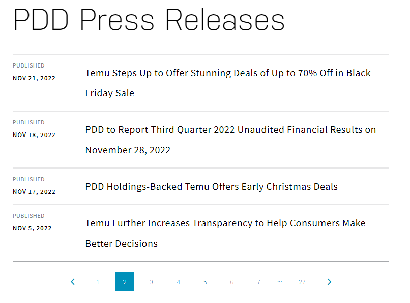
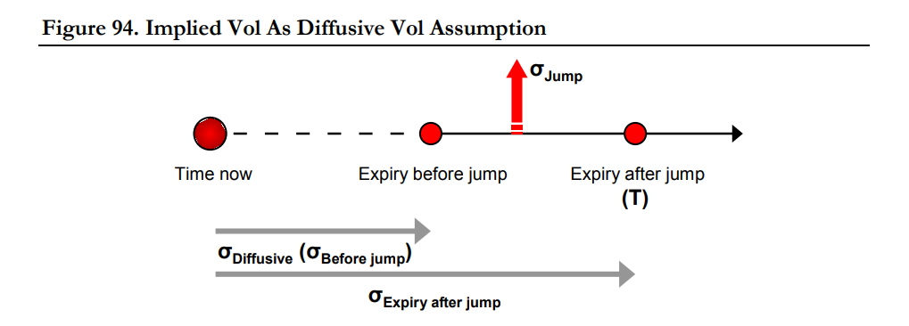

## EARNINGS ANNOUNCEMENT FORECAST

This is an innovation from the [Predicting Alpha 100k Trading Challenge](https://www.youtube.com/live/wMr3nkcR2TQ?feature=share&t=10800) to forecast earnings announcements! Prior to any code, I used the PA Terminal to find tickers with unconfirmed earnings that are about 3-4 weeks away. This analysis will be looking at $PDD.

### Loading Libraries & Utilities
Source code in [utils.R](utils.R)

```
source("utils.R")
```

### Setting Up RSelenium
In the video, Jordan collects the historical earnings announcements and hints at the usefulness of press release dates to model future earnings announcements. I will be using [RSelenium](https://github.com/ropensci/RSelenium) to scrape both of these values.  
First, I connect to the driver then save the client object.

```
# need to download firefox + java
rs_driver_obj <- rsDriver(
  browser = "firefox",
  chromever = NULL,
  verbose = FALSE,
  port = free_port())
  
rs_client <- rs_driver_obj$client
```

### RSelenium cont.
- Navigated to [$PDD's press release data from nasdaq](https://www.nasdaq.com/market-activity/stocks/pdd/press-releases).
- The table is paginated. I scraped the maximum number of pages on the table (27).

```
rs_client$navigate("https://www.nasdaq.com/market-activity/stocks/pdd/press-releases")

pages <- rs_client$findElements("css selector", "button.pagination__page")
max_page <- lapply(1:length(pages), function(x){
  as.numeric(pages[[x]]$getElementText())
}) %>%
  unlist(.) %>%
  max(.)
```

How the table looks:



### RSelenium cont.
- Created an empty list called tbl to store each table page with a for loop. 
- Binded the list to a data.frame.
- Noticed in the earlier picture that the way $PDD announces their earnings are in a specific format that can be retrieved via the title alone. 
  - Every earnings announcement also contained this phrase in the title: *Financial Results on {date}*.
- Filtered the table for titles that contained this phrase and extracted the earnings announcement to a separate column.

```
tbl <- list()

for(x in 1:max_page){
  
  if(x > 1){
    rs_client$findElement("css selector", "button.pagination__next")$clickElement()
  }
  
  page_source <- rs_client$getPageSource()[[1]]
  
  timestamp <- read_html(page_source) %>%
    html_nodes("div.quote-press-release__card-timestamp") %>%
    html_text() %>%
    mdy()
  
  title <- read_html(page_source) %>%
    html_nodes("a.quote-press-release__link") %>%
    html_text()
  
  tbl[[x]] <- data.frame(
    announced = timestamp[c(TRUE, FALSE)],
    title = title,
    row.names = NULL)
}

pdd_earnings_dates <- bind_rows(tbl) %>%
  filter(str_detect(str_squish(title), "Financial Results on ")) %>%
  mutate(earnings = mdy(str_split_i(str_squish(title), "Financial Results on ", 2))) %>%
  distinct(announced, earnings, .keep_all = TRUE)
```

Sample of the table:  
- announced: date of the press release announcing the earnings date
- title: title of the press release
- earnings: earnings announcement that was extracted from the title

|announced            |title   |earnings                        |
|---------------------|--------|--------------------------------|
|2022-11-18           |PDD to Report Third Quarter 2022 Unaudited Financial Results on November 28, 2022|2022-11-28                      |
|2022-08-19           |Pinduoduo to Report Second Quarter 2022 Unaudited Financial Results on August 29, 2022|2022-08-29                      |
|2022-05-15           |Pinduoduo to Report First Quarter 2022 Unaudited Financial Results on May 27, 2022|2022-05-27                      |
|2022-03-11           |Pinduoduo to Report Fourth Quarter and Fiscal Year 2021 Unaudited Financial Results on March 21, 2022|2022-03-21                      |
|2021-11-16           |Pinduoduo to Report Third Quarter 2021 Unaudited Financial Results on November 26, 2021|2021-11-26                      |


### Earnings Announcement Analysis
Followed the analysis example from the video to create some metrics.

```
earnings_forecast <- pdd_earnings_dates %>%
  select(announced, earnings) %>%
  arrange(earnings) %>%
  mutate(weekday = weekdays(earnings),
         quarter = quarter(earnings),
         week = week(earnings),
         ern2ern_diff = as.numeric(earnings - lag(earnings)),
         an2ern_diff = as.numeric(earnings - announced),
         wk2wk_diff = abs(week - lag(week))) %>%
  arrange(desc(earnings)) 
```

Sample of the table:  
- week: week-of-the-year
- ern2ern_diff: difference between earnings announcements (earnings)
- an2ern_diff: difference between the press release (announced) and the earnings announcements
- wk2wk_diff: difference between the week-of-the-year of each earnings announcements

|announced            |earnings|weekday                         |quarter|week|ern2ern_diff|an2ern_diff|wk2wk_diff|
|---------------------|--------|--------------------------------|-------|----|------------|-----------|----------|
|2022-11-18           |2022-11-28|Monday                          |4      |48  |91          |10         |13        |
|2022-08-19           |2022-08-29|Monday                          |3      |35  |94          |10         |14        |
|2022-05-15           |2022-05-27|Friday                          |2      |21  |67          |12         |9         |
|2022-03-11           |2022-03-21|Monday                          |1      |12  |115         |10         |36        |
|2021-11-16           |2021-11-26|Friday                          |4      |48  |94          |10         |14        |


### Scraping CBOE Option Chain Data
We will revisit the earnings announcement forecast. Now, we are going to be scraping and cleaning $PDD's option chain data from [CBOE](https://www.cboe.com/delayed_quotes/pdd/quote_table).  

```
pdd_data <- fromJSON("https://cdn.cboe.com/api/global/delayed_quotes/options/PDD.json")

opt_chain <- pdd_data$data$options %>%
  select(option, iv, delta) %>%
  mutate(expiry = ymd(str_sub(option, -15, -10)),
         dte = as.numeric(expiry - as.Date(pdd_data$timestamp)),
         type = ifelse(str_sub(option, -9, -9) == "C", "call", "put"),
         strike = str_sub(option, -8, -1),
         strike = as.numeric(paste(str_sub(strike, -8, -4), str_sub(strike, -3, -1), sep = "."))) %>%
  filter(type == "call") %>%
  group_by(expiry) %>%
  filter(abs(delta-0.5) == min(abs(delta-0.5))) %>%
  select(expiry, type, dte, strike, iv, delta) %>%
  ungroup()
  ```
  
  Sample of the table:  
  Extracted & cleaned option data. Filtered for call options that were nearest to 0.50 delta at each expiration. Noticed that there are weekly contracts.
  - dte: days-to-expiration
  - iv: implied volatility
  
  |expiry               |type    |dte                             |strike|iv |delta|
|---------------------|--------|--------------------------------|------|---|-----|
|2023-02-24           |call    |0                               |84    |0.5651|0.417|
|2023-03-03           |call    |7                               |84    |0.5215|0.5057|
|2023-03-10           |call    |14                              |84    |0.5556|0.5196|
|2023-03-17           |call    |21                              |85    |0.6032|0.4977|
|2023-03-24           |call    |28                              |86    |0.7129|0.4959|


### Event Table
Filtered for nearer expirations. The calculations for this table can be read at [Trading Volatility by Collin Bennet](https://www.trading-volatility.com/Trading-Volatility.pdf).  

```
event_tbl <- opt_chain %>%
  arrange(expiry) %>%
  filter(dte-lag(dte) <= 7) %>%
  mutate(nonevent_vol = 0.5556,
         event_vol = event_vol(nonevent_vol, iv, dte),
         event_move = event_move(event_vol),
         across(event_vol:event_move, function(x) round(x, 4)))
 ```
         
Sample of the table:  
As we can see, the event_move increases up til the 24th and starts to taper off (gets more diluted with additional periods). The market thinks that the next earnings announcement will be within the 24th expiry.
- nonevent_vol: *diffusive volatility (before jump)*, this number was picked from the 2023-03-10 iv because it's before the event.
- event_vol: event volatility 
- event_move: the implied jump from the event

|expiry    |type|dte|strike|iv    |delta |nonevent_vol|event_vol|event_move|
|----------|----|---|------|------|------|------------|---------|----------|
|2023-03-03|call|7  |84    |0.5215|0.5057|0.5556      |0.2271   |0.0095    |
|2023-03-10|call|14 |84    |0.5556|0.5196|0.5556      |0.5556   |0.0232    |
|2023-03-17|call|21 |85    |0.6032|0.4977|0.5556      |1.2112   |0.0506    |
|2023-03-24|call|28 |86    |0.7129|0.4959|0.5556      |2.4281   |0.1014    |
|2023-03-31|call|35 |86    |0.6782|0.5029|0.5556      |2.3671   |0.0989    |
|2023-04-06|call|41 |86    |0.6613|0.5084|0.5556      |2.3627   |0.0987    |

### Non-event and Event Volatility Explained
The below figure is on page 179 from Trading Volatility. This chapter (6.4) illustrates how a person can trade the event jump by structuring across the term structure. The figure details how I got my nonevent_vol number by selecting the options that expire before the event (jump). This nonevent_vol is also referred to as the *diffusive* volatility. [Here](images/collin_fig_3.png) is the formula for how event_vol and event_move's are calculated (source code [@utils.R](utils.R)).



### Analyzing Future Expirations 
With the earnings forecast table we created a few sections ago, I filtered for the upcoming quarter (1) and created a benchmark that calculates the min, avg, and max values of the week, wk2wk_diff, and ern2ern_diff.  
Joined this benchmark table with the event_tbl of possible earnings announcements in the future to detect any patterns.

```
benchmark <- earnings_forecast %>%
  filter(quarter == 1) %>%
  select(earnings, week, wk2wk_diff, ern2ern_diff) %>%
  pivot_longer(week:ern2ern_diff) %>%
  group_by(name) %>%
  summarise(min = min(value, na.rm = TRUE),
            avg = round(mean(value, na.rm = TRUE)),
            max = max(value, na.rm = TRUE))
            
final_tbl <- event_tbl %>%
  select(expiry, event_move) %>%
  filter(dplyr::between(expiry, as.Date("2023-03-17"), as.Date("2023-03-31"))) %>%
  mutate(last_er = max(earnings_forecast$earnings),
         week = week(expiry),
         wk2wk_diff = abs(week - week(last_er)),
         ern2ern_diff = as.numeric(expiry - last_er)) %>%
  pivot_longer(week:ern2ern_diff) %>%
  pivot_wider(id_cols = name, names_from = expiry, values_from = value) %>%
  left_join(benchmark, by = "name")
```

### Final Table
Shifted the data to a long format which shows three possible future earnings announcements and benchmark metrics. Across the 2023-03-17, 2023-03-24, and 2023-03-31 expirations, the 24th expiration best fits the patterns we've observed in the past for earnings announcements within the first quarter. This is the same view that the market has, so no trade.

|name      |2023-03-17|2023-03-24|2023-03-31|min   |avg   |max   |
|----------|----------|----------|----------|------|------|------|
|week      |11        |12        |13        |11    |11    |12    |
|wk2wk_diff|37        |36        |35        |23    |32    |36    |
|ern2ern_diff|109       |116       |123       |112   |145   |208   |


### Remarks
In the video, Jordan showcases a forecast of the event's implied move and talked about trading this if the earnings announcement was confirmed. Unfortunately, to create a forecast of the implied move I would need to model historical data. I decided this kind of data would be outside of the scope for this project and excluded it.
