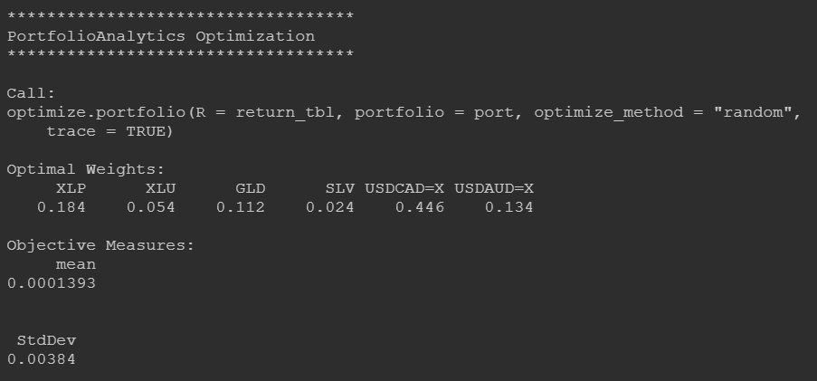
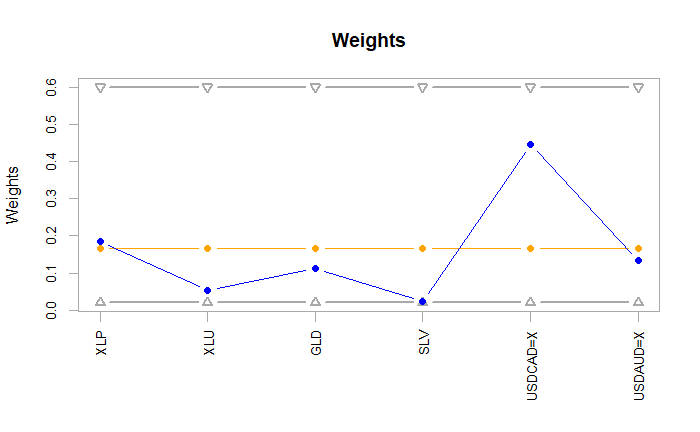
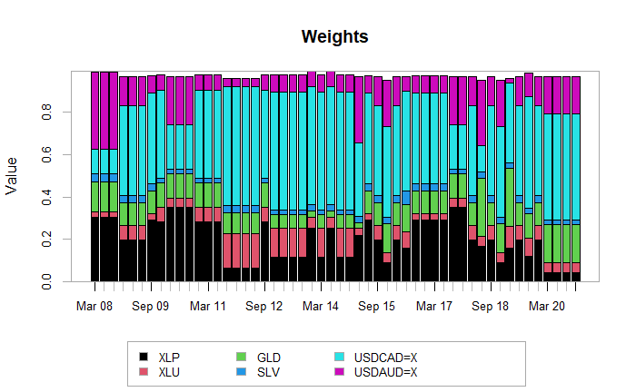
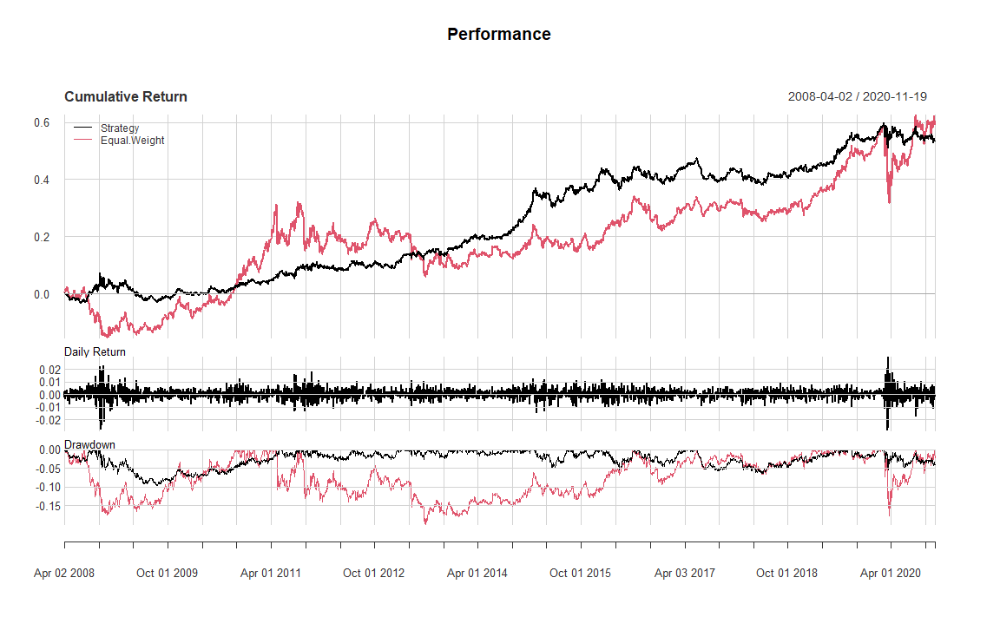

## PORTFOLIO OPTIMIZATION

This is a recreation of the demonstration from the Academy, Gold 2.7 - *Constructing a Portfolio and Improving Your Sharpe Ratio*.

### Loading Libraries

```
library(tidyverse)
library(quantmod)
library(PortfolioAnalytics)
```

### Setting Variables
tickers: a character vector of the same tickers from the video  
date_from: beginning of the date value range from the video  
date_to: ending of the date value range from the video   
I've also set the seed since some of the later portfolio options uses rng.

```
set.seed(123)

tickers <- c("XLP", "XLU", "GLD", "SLV", "USDCAD=X", "USDAUD=X")
date_from <- as.Date("2007-01-03")
date_to <- as.Date("2020-11-19")
```

### Pulling Price Data & Calculating Returns
Initially, I transformed the data to a data.frame to use the tidyverse toolkit for data manipulation. Later on, I realized that the table format required for PerformanceAnalytics functions are xts/zoo! I had to change it back, lol.
- ticker_list: a list of data.frames that has each ticker's price data from yahoo
  - pulled adjusted prices and filtered for within the date range set previously
- return_tbl: an xts/zoo table that has each ticker's log rate-of-change

```
ticker_list <- lapply(1:length(tickers), function(x){
  tbl <- getSymbols(Symbols = tickers[x], src = "yahoo", return.class = "data.frame", auto.assign = FALSE) %>%
    suppressWarnings()
  
  price_tbl <- tbl %>%
    mutate(Date = as.Date(row.names(.), format = "%Y-%m-%d")) %>%
    filter(dplyr::between(Date, date_from, date_to)) %>%
    select(Date, ends_with("Adjusted")) 
  
  names(price_tbl) <- c("Date", tickers[x])
  
  return(price_tbl)
})

return_tbl <- reduce(ticker_list, full_join, by = "Date") %>%
  arrange(Date) %>%
  drop_na() %>%
  mutate(across(where(is.numeric), function(x) ROC(x))) %>%
  drop_na() 
  
return_tbl <- as.zoo(return_tbl[,!names(return_tbl) %in% "Date"], order.by = return_tbl$Date)
```

### Building Portfolio
In the video, they changed the code a few times to adjust for a long and short/long portfolios. This recreation will only have the *long portfolio*.  
I am not familiar with the PortfolioAnalytics functions so from here-on, I did a lot of copying from the video. Jordan does a good job in the video explaining the meaning of each function and how it ties together with optimizing a portfolio. 

```
port <- NULL
port <- portfolio.spec(names(return_tbl))
port <- add.constraint(port, type = "weight_sum", min_sum = 0.95, max_sum = 1.05)
port <- add.constraint(port, type = "box", min = 0.02, max = 0.6)
port <- add.objective(portfolio = port, type = "return", name = "mean")
port <- add.objective(portfolio = port, type = "risk", name = "StdDev")

optimized_port <- optimize.portfolio(R = return_tbl, portfolio = port, optimize_method = "random", trace = TRUE)
```
### optimized_port Object
- Call: function used
- Weights: the weights of each ticker in the optimized_port
- Objective Measures: the mean and standard deviation of the portfolio's returns



### Charting Optimized Portfolio Weights
- The series with the triangle markers that bounds the data are the constraints we put on the weight of a ticker
- The blue series is the optimized weight of each ticker
- Unsure about the orange series but it has a close value to the weight's average (0.184)



### Rebalance Portfolio Through Time
As explained in the video, this is a rolling rebalancing of the weights of the tickers throughout time. 

```
rebalanced_port <- optimize.portfolio.rebalancing(
  R = return_tbl,
  portfolio = port,
  optimize_method = "random",
  rp = random_portfolios(port, 1000, "sample"),
  rebalance_on = "quarters",
  training_period = 252,
  rolling_window = 252)
  
chart.Weights(rebalanced_port)
```

### Chart Moving Weights
Displays how the weights of each ticker changes throughout time.



### Performance Summary: Rebalanced Portfolio vs Equal-Weighted Portfolio
We took our rolling rebalanced portfolio and compared it's performance if the same tickers were equally weighted.

```
rebalanced_returns <- Return.portfolio(R = return_tbl, extractWeights(rebalanced_port))
names(rebalanced_returns) <- "Strategy"

benchmark <- Return.portfolio(R = return_tbl, weights = rep(1/ncol(return_tbl), ncol(return_tbl)))
names(benchmark) <- "Equal Weight"

port_comp <- na.omit(cbind(rebalanced_returns, benchmark))
charts.PerformanceSummary(port_comp, main = "Performance", geometric = TRUE)
```

### Performance Chart



### Portfolio Analytics
As seen in the video, the Sharpe Ratio of the rolling rebalanced portfolio is almost doubled the equally-weighted one. All-in-all, the numbers are slightly different from the video because I do not know the seed they used for their rng functions.

```
table.AnnualizedReturns(port_comp)
```

|                           | Strategy | Equal Weight |
|---------------------------|----------|--------------|
| Annualized Return         | 0.0344   | 0.0374       |
| Annualized Std Dev        | 0.0652   | 0.1101       |
| Annualized Sharpe (Rf=0%) | 0.5275   | 0.3399       |
